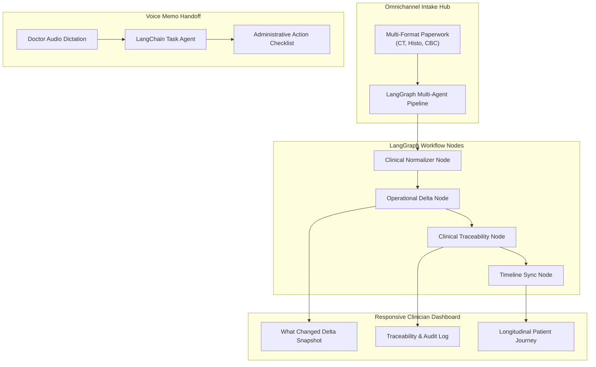

# Care Chronicle • Assistive Outpatient Oncology Assistant

> **A clinician-focused, assistive outpatient oncology assistant designed to reduce clinician administrative burden and pre-consultation review friction during oncology consultations.**
> 
> *Strictly Assistive, Non-Diagnostic, and Workflow-First • Operates Exclusively on 100% Synthetic Medical Records.*

### 🔗 Official Presentation & Evaluation Links
- 🌐 **Live Interactive Web Prototype:** [https://aneeshtiwari13.github.io/care-chronicle/](https://aneeshtiwari13.github.io/care-chronicle/)
- 💻 **Open-Source GitHub Repository:** [https://github.com/aneeshtiwari13/care-chronicle](https://github.com/aneeshtiwari13/care-chronicle)

---

## 🌟 Overview & Clinical Motivation

Outpatient oncology follow-up consultations involve reviewing dense, heterogeneous paperwork—cross-sectional imaging (CT/MRI), surgical histopathology, serial tumor markers, and pre-chemotherapy blood panels. Clinicians often spend substantial time manually compiling prior visit records to determine operational deltas.

**Care Chronicle** solves this through automated background ingestion and synthesis:
- **Never Diagnoses or Prescribes:** Operates strictly as an administrative and organizational intelligence layer.
- **Sub-Minute Chart Review:** Achieves prep times below 60 seconds (measured dynamically).
- **Handoff Lag Reduction:** Converts doctor voice memos into structured administrative task checklists, saving an average of 2.4 minutes per consultation over end-of-day batching.
- **Zero Raw Text / Notepad Views:** All source documents and lab artifacts render as styled digital medical records with hospital letterheads (*Celabs Diagnostics Pvt. Ltd.*), patient metadata, and structured clinical tables.

---

## 🏗️ Architecture & Technology Stack

- **Orchestration Framework:** [LangGraph](https://github.com/langchain-ai/langgraph) & [LangChain](https://github.com/langchain-ai/langchain) (Multi-agent document ingestion graph, clinical normalizer, operational delta comparator, and voice memo task classifier).
- **Backend:** Python ([FastAPI](https://fastapi.tiangolo.com/)).
- **Document Processing:** Background multi-format parser with clinical range validation and CTCAE toxicity mapping.
- **Frontend:** Modern responsive card-based web interface with Tailwind CSS, Lucide icons, dynamic Light/Dark mode, and 7-language UI chrome localization.



---

## 👥 Synthetic Patient Profiles (60–90 Day Longitudinal Pilot)

Care Chronicle ships with 5 distinct, fully anonymized synthetic oncology profiles:

1. **Rajesh Sharma (58M):** Stage IIIB Sigmoid Colon Adenocarcinoma (pT3N2aM0, MSS) on Adjuvant mFOLFOX-6 (Cycle 3 of 12).
2. **Anita Devi (52F):** Invasive Ductal Carcinoma Left Breast (Grade 2, ER+/PR+/HER2-) on Dose-Dense AC-T (Cycle 2 of 4).
3. **Vikram Singh (64M):** Non-Small Cell Lung Adenocarcinoma Stage IV (EGFR Exon 21 L858R) on Targeted Osimertinib 80mg Daily.
4. **Priya Nair (46F):** High-Grade Serous Ovarian Carcinoma Stage IIIC on Carboplatin + Paclitaxel + Bevacizumab (Cycle 4 of 6).
5. **Mohammed Al-Farsi (61M):** Multiple Myeloma IgG Kappa Stage II (Very Good Partial Response) on VRd Regimen (Cycle 4 of 4).

---

## 🚀 Quickstart & Installation

### Prerequisites
- Python 3.10, 3.11, or 3.12
- Git

### 1. Clone the Repository
```bash
git clone https://github.com/<your-username>/care-chronicle.git
cd care-chronicle
```

### 2. Set Up Virtual Environment & Dependencies
```bash
# Using standard venv
python -m venv venv
# On Windows:
venv\Scripts\activate
# On macOS/Linux:
source venv/bin/activate

# Install dependencies
pip install -r requirements.txt
```

*(Alternatively, using [uv](https://github.com/astral-sh/uv) for instant setup):*
```bash
uv venv
uv pip install -r requirements.txt
```

### 3. Launch the Server
```bash
python run_server.py
```
Open your browser and navigate to:
```
http://127.0.0.1:8050
```

---

## 🩺 Key Features & Walkthrough

| Feature | Description |
| :--- | :--- |
| **Preparation Timer (KPI 1)** | Dynamic timer starts upon loading patient profile; tracks sub-minute prep benchmark upon clicking *"Finished Chart Review"*. |
| **Handoff Lag Tracker (KPI 2)** | Demonstrates a 2.4-minute task reduction per consult versus traditional end-of-day batching. |
| **"What Changed" Operational Delta** | 3-point high-level summary comparing latest visit values against baseline with human-authored clinical bullet styling. |
| **Active Oncology Milestone Tracker** | Visual tracker showing active chemotherapy cycle, scheduled infusion time, and upcoming restaging imaging dates. |
| **Patient History Archive** | Dedicated tab in Column 2 showing aggregated surgical anchors, serial lab trend tables, stored voice notes, and past ingested files. |
| **Omnichannel Intake Hub** | Background drag-and-drop file ingestion with 1-click sample testing (CT Scan, Histopathology, CBC Blood Panel). |
| **Voice Memo Dictation** | Post-consultation audio recorder with Web Speech API support and sample fallback button. |
| **Clinical Traceability Audit Log** | Structured human-in-the-loop audit table using natural clinician English (zero technical jargon). |
| **7-Language UI Chrome Localization** | Select between English, हिंदी, मराठी, বাংলা, తెలుగు, ਪੰਜਾਬੀ, and Español. Clinical data remains strictly in medical English. |

---

## 🔒 Safety & Regulatory Notice

> **NON-DIAGNOSTIC & REGULATORY NOTICE:** Care Chronicle is strictly an organizational and assistive workflow tool designed to reduce clinician administrative burden during outpatient oncology consultations. It does not diagnose, prescribe, or provide clinical decision support. All clinical evaluations, treatment decisions, and orders remain the sole responsibility of the licensed oncologist. All data shown is 100% synthetic.

---

## 📄 License
This project is open-source under the [MIT License](LICENSE).
